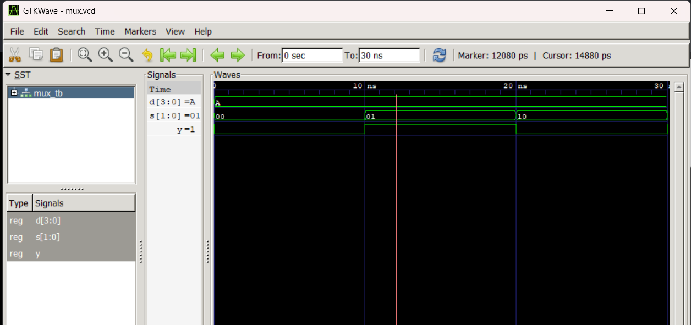
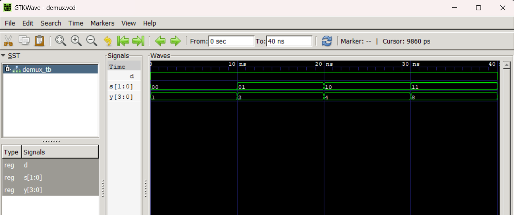

# Lab 4: VHDL Code for Combinational Circuits (MUX and DEMUX)

---

## Objective

- To design and simulate a **4-to-1 Multiplexer (MUX)** in VHDL.
- To design and simulate a **1-to-4 Demultiplexer (DEMUX)** in VHDL.

---

## Theory

### Multiplexer (MUX)

A multiplexer selects one of 2ⁿ input data lines and routes it to a single output based on **n select lines**. A **4-to-1 MUX** has 4 data inputs (D0–D3), 2 select lines (S1, S0), and 1 output (Y).

| S1 | S0 | Y  |
|----|----|----|
| 0  | 0  | D0 |
| 0  | 1  | D1 |
| 1  | 0  | D2 |
| 1  | 1  | D3 |

### Demultiplexer (DEMUX)

A demultiplexer routes a single input to one of 2ⁿ output lines based on **n select lines**. A **1-to-4 DEMUX** has 1 data input (D), 2 select lines (S1, S0), and 4 outputs (Y0–Y3).

| S1 | S0 | Active Output |
|----|----|---------------|
| 0  | 0  | Y0 = D        |
| 0  | 1  | Y1 = D        |
| 1  | 0  | Y2 = D        |
| 1  | 1  | Y3 = D        |

---

## Files Included

| File | Description |
|------|-------------|
| `mux_4to1.vhd` | VHDL implementation of the 4-to-1 Multiplexer |
| `mux_tb.vhd` | Testbench for the 4-to-1 MUX |
| `demux_1to4.vhd` | VHDL implementation of the 1-to-4 Demultiplexer |
| `demux_tb.vhd` | Testbench for the 1-to-4 DEMUX |
| `mux.vcd` | Value Change Dump output for MUX simulation |
| `demux.vcd` | Value Change Dump output for DEMUX simulation |
| `work-obj93.cf` | GHDL work library configuration file |

---

## Simulation

Simulation was performed using **GHDL** and waveforms were viewed in **GTKWave**.

### Commands Used

**MUX:**
```bash
ghdl -a mux_4to1.vhd mux_tb.vhd
ghdl -e MUX_TB
ghdl -r MUX_TB --vcd=mux.vcd
gtkwave mux.vcd
```

**DEMUX:**
```bash
ghdl -a demux_1to4.vhd demux_tb.vhd
ghdl -e DEMUX_TB
ghdl -r DEMUX_TB --vcd=demux.vcd
gtkwave demux.vcd
```

---

## Simulation Results

### 4-to-1 MUX Waveform

The testbench drives `D = "1010"` (D3=1, D2=0, D1=1, D0=0) and cycles through all four select combinations every 10 ns.

| Time     | S[1:0] | Expected Y |
|----------|--------|------------|
| 0–10 ns  | 00     | D0 = 0     |
| 10–20 ns | 01     | D1 = 1     |
| 20–30 ns | 10     | D2 = 0     |
| 30–40 ns | 11     | D3 = 1     |



---

### 1-to-4 DEMUX Waveform

The testbench drives `D = '1'` and cycles through all four select combinations, then sets `D = '0'` for a final case.

| Time     | D | S[1:0] | Y[3:0] |
|----------|---|--------|--------|
| 0–10 ns  | 1 | 00     | 0001   |
| 10–20 ns | 1 | 01     | 0010   |
| 20–30 ns | 1 | 10     | 0100   |
| 30–40 ns | 1 | 11     | 1000   |
| 40–50 ns | 0 | 10     | 0000   |



---

## Conclusion

Both the 4-to-1 MUX and 1-to-4 DEMUX were successfully designed in VHDL using a behavioral architecture with a `case` statement. Simulation results from GHDL and GTKWave confirm that the output waveforms match the expected truth table values for all select line combinations. The designs demonstrate correct data routing behavior for combinational logic circuits.
