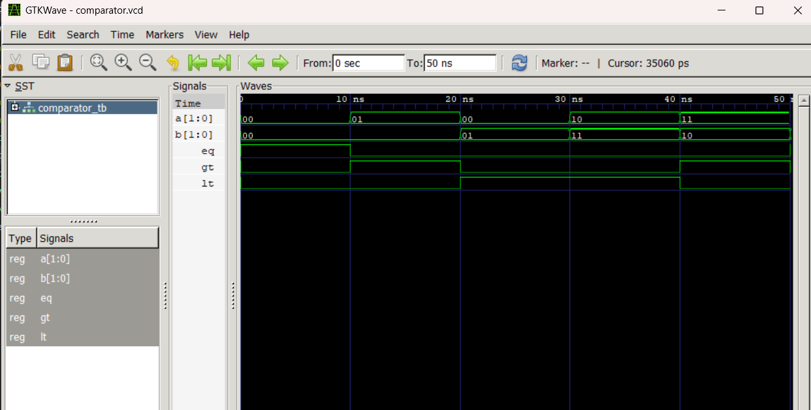

# Lab 5: VHDL Code for Combinational Circuits (2-Bit Comparator)

---

## Objective

- To design and simulate a **2-Bit Magnitude Comparator** in VHDL.

---

## Theory

### Comparator

A magnitude comparator compares two binary numbers and determines their relationship. A **2-bit comparator** takes two 2-bit inputs (A and B) and produces three output signals indicating whether A is equal to, greater than, or less than B.

| A[1:0] | B[1:0] | EQ | GT | LT |
|--------|--------|----|----|----|
| 00     | 00     | 1  | 0  | 0  |
| 01     | 00     | 0  | 1  | 0  |
| 00     | 01     | 0  | 0  | 1  |
| 10     | 11     | 0  | 0  | 1  |
| 11     | 10     | 0  | 1  | 0  |
| 11     | 11     | 1  | 0  | 0  |

- **EQ** = 1 when A = B  
- **GT** = 1 when A > B  
- **LT** = 1 when A < B  

---

## Files Included

| File | Description |
|------|-------------|
| `comparator_2bit.vhd` | VHDL implementation of the 2-Bit Comparator |
| `comparator_tb.vhd` | Testbench for the 2-Bit Comparator |
| `comparator.vcd` | Value Change Dump output for Comparator simulation |
| `work-obj93.cf` | GHDL work library configuration file |

---

## Simulation

Simulation was performed using **GHDL** and waveforms were viewed in **GTKWave**.

### Commands Used

```bash
ghdl -a comparator_2bit.vhd comparator_tb.vhd
ghdl -e COMPARATOR_TB
ghdl -r COMPARATOR_TB --vcd=comparator.vcd
gtkwave comparator.vcd
```

---

## Simulation Results

### 2-Bit Comparator Waveform

The testbench applies six different combinations of A and B, each lasting 10 ns, to verify all three comparison outputs.

| Time      | A[1:0] | B[1:0] | EQ | GT | LT |
|-----------|--------|--------|----|----|----|
| 0–10 ns   | 00     | 00     | 1  | 0  | 0  |
| 10–20 ns  | 01     | 00     | 0  | 1  | 0  |
| 20–30 ns  | 00     | 01     | 0  | 0  | 1  |
| 30–40 ns  | 10     | 11     | 0  | 0  | 1  |
| 40–50 ns  | 11     | 10     | 0  | 1  | 0  |
| 50–60 ns  | 11     | 11     | 1  | 0  | 0  |



---

## Conclusion

The 2-bit magnitude comparator was successfully designed in VHDL using a behavioral architecture with an `if-elsif-else` statement inside a process block. Simulation results from GHDL and GTKWave confirm that the EQ, GT, and LT output signals correctly reflect the magnitude relationship between the two 2-bit inputs for all test cases. The design demonstrates proper combinational logic behavior for a magnitude comparator circuit.
